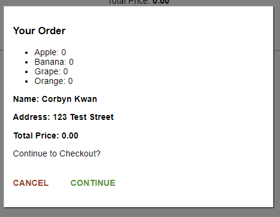
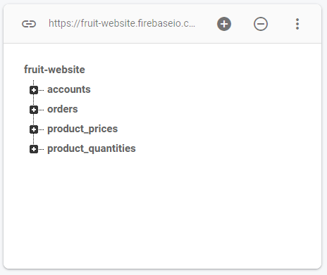
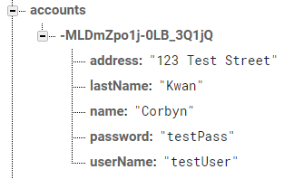
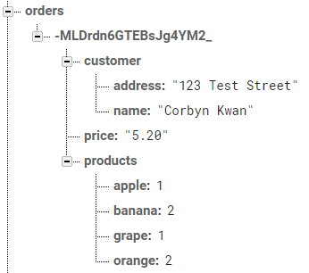

# 4Hour Fruit Shop Website Coding Challenge

---

### Table of Contents

- [Description](#description)
- [How To Use](#how-to-use)
- [My Information](#My-Information)

---

## Description

A Fruit Shop Website done for the coding challenge. Users can create an account and buy fruits which sends it to the firebase server that stores their order.

#### Technologies

- React
- Firebase
- HTML5
- CSS
- Git

[Back To The Top](#4Hour-Fruit-Shop-Website-Coding-Challenge)

---

## How To Use

### Opening the website

Open the terminal and go to the project directory. Then you run in order:
#### `npm install`
Installs dependencies into the /node_modules directory. 

#### `npm start`

Runs the app in the development mode. 
Open [http://localhost:3000](http://localhost:3000) to view it in the browser. You should see a UI like this:

You can click **Less/More** on each product item to increase the quantity of the product(s) you want. 
 

Click **Order Now** for an order summary to be shown:

Click **CONTINUE** for your order to be processed and uploaded to the **database**. Information on how to view the **database** can be viewed [here](#Viewing-the-Database )

Apart from ordering you can also create an account by clicking the **Create Account** button.  

Enter a unique **username** and **password** not in the database amd click **Create Account**, and an account will be added to the database. 

Afterwards enter the **username** and **password** of your newly created account in the login form. This notification should appear:

### Viewing the Database  
Click this [link](https://console.firebase.google.com/project/market-project-da10f/database/market-project-da10f/data) to view the database in the browser. You should see a UI like this:

You can click the **+** icon to view the fields of these variables . 

The following is an explations of what each variable's purpose is:
#### `accounts`
Stores all the **accounts** created. 

#### `orders`
Stores all the **orders** created. Each order stores a **name**, **address**, **price**, and **products**  

#### `product_prices`
Stores all the **price of each product**

You can change the price of the products by **double clicking** on the value, **typing** the desired price, and **pressing** the enter key. **Refresh** the website and the changes will be reflected.

#### `products`
Stores the name of **products** that are being sold 

You can change the price of the products by **double clicking** on the value, **typing** the desired quantity, and **pressing** the enter key. **Refresh** the website and the changes will be reflected.
#### API Reference

[Back To The Top](#4Hour-Fruit-Shop-Website-Coding-Challenge)

---

## My Information

 

[Back To The Top](#4Hour-Fruit-Shop-Website-Coding-Challenge)
